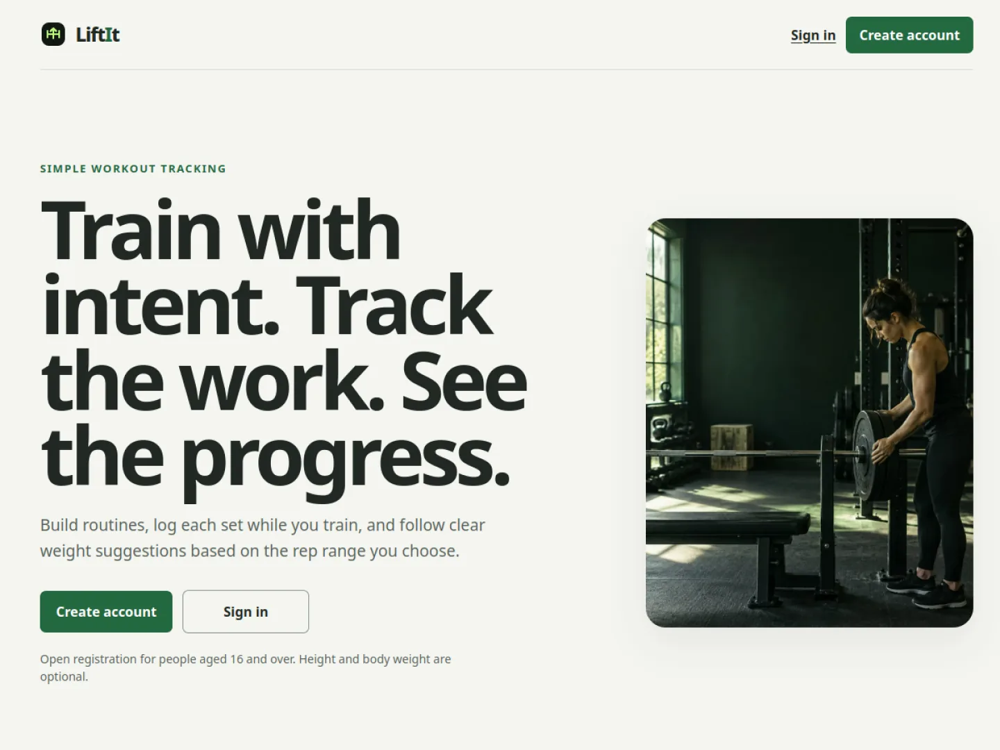

# LiftIt

LiftIt is a mobile-first workout tracker with simple, explainable weight
progression. It is built for real use during gym sessions: create a routine,
record each set as it happens, resume after a refresh, and see how each exercise
is progressing.

**[Open the live public beta](https://www.lift-it.site/)**



The workout tracker is the complete v1 focus. Calorie tracking, social features,
a native application, and an AI assistant are deliberately deferred.

## What the product does

- Password registration, email verification, recovery, and private accounts.
- Consent-aware onboarding with an optional height and body-weight history.
- A curated 73-exercise library with images, filters, and instructions.
- Reusable workouts with ordered exercises, planned sets, rest timers, rep
  ranges, and equipment-specific settings.
- Resumable live sessions that save each completed set immediately.
- Weekly attendance, recent sessions, and 12-week exercise progress charts.
- Kilogram and pound display preferences with canonical kilogram storage.
- System, light, and dark themes in a stable mobile-first interface.

## The standout feature: explainable progression

Each exercise can use a user-defined rep range and either a fixed increment or a
list of available weights. When a non-warmup set is completed:

- Reps above the upper bound increase the next weight.
- Reps below the lower bound decrease the next weight.
- Reps inside the inclusive range keep the weight unchanged.

For a 6-10 rep target, 11 reps moves the recommendation up, 5 reps moves it
down, and 6 or 10 reps leaves it unchanged. Failure sets use the same rule;
warmup sets do not affect progression. A manual weight override can apply to one
set or become the new recommendation going forward.

The completed set and its progression update are stored in one database
transaction. Retry IDs prevent duplicate writes, and a set can be reopened while
the workout remains active so the stored recommendation can be recalculated.

## Engineering highlights

- React presentation is separated from tested progression and weight-conversion
  rules.
- Supabase Postgres functions make profile, routine, session, set, and
  progression writes atomic.
- Row Level Security and ownership checks isolate every user's workout data.
- Confirmed sets survive refreshes; recoverable save failures keep entered data
  visible and retryable.
- Route-level loading, stable image dimensions, CSS layout, timestamp-based
  timers, and reduced-motion support keep the live workout responsive.
- Production and preview deployments use separate Supabase projects.
- The release process includes hosted rollback-only SQL tests, real email and
  authentication checks, security-header verification, and encrypted exports.
- The current quality gate covers 112 unit/component tests, five database suites,
  linting, formatting, strict TypeScript, and a production build.
- Eleven Architecture Decision Records and a dated progress log preserve the
  reasoning behind non-trivial decisions for review and interviews.

## Technology

- React 19 and TypeScript 6
- Vite 8 for local development and production builds
- React Router for client-side navigation
- Supabase Postgres and Authentication
- Plain mobile-first CSS
- Vitest and Testing Library
- Oxlint and Prettier
- Vercel and GitHub Actions

The stack decision is recorded in [ADR 0001](docs/adr/0001-frontend-and-backend-stack.md).

## Run locally

Requirements:

- Node.js 24.x
- npm 11.x

```bash
fnm use
npm install
cp .env.example .env.local
npm run dev
```

Add the Supabase project URL and publishable key to `.env.local`. Never expose a
service-role key through a variable beginning with `VITE_`; Vite includes those
values in browser code. The full environment and migration procedure is in
[the account setup guide](docs/account-setup.md).

## Verification

```bash
npm run check
```

This runs linting, formatting verification, 112 frontend tests, five local SQL
suites, strict TypeScript compilation, and the production build. GitHub Actions
runs the same command for pull requests and pushes to `main`.

Individual commands are also available:

| Command                | Purpose                                              |
| ---------------------- | ---------------------------------------------------- |
| `npm run dev`          | Start the local development server                   |
| `npm run test`         | Run frontend tests in watch mode                     |
| `npm run test:db`      | Run database migrations and SQL assertions in PGlite |
| `npm run lint`         | Check source files with Oxlint                       |
| `npm run format:check` | Verify repository formatting                         |
| `npm run typecheck`    | Run strict TypeScript checks                         |
| `npm run build`        | Create the production build                          |
| `npm run check`        | Run the complete repository quality gate             |

## Project documentation

- [Product design](docs/design.md)
- [Progress log](docs/progress.md)
- [Architecture decisions](docs/adr/)
- [Performance review](docs/performance.md)
- [Web quality and security audit](docs/web-quality-audit.md)
- [Original project plan](Overall%20plan,%20subject%20to%20change.md)
- [Browser-aware frontend guide](Browser-Aware%20Web%20Design%20for%20LiftIt.md)

## Repository structure

```text
docs/                   Product design, progress, audits, and architecture decisions
public/                 Static images and search metadata
src/auth/               Authentication and protected-route state
src/exercises/          Curated exercise library and picker
src/profile/            Onboarding, preferences, and body-weight history
src/sessions/           Live workout logging and progression rules
src/workouts/           Routine creation, editing, and session start
supabase/migrations/    Reviewed database history
supabase/tests/         Rollback-only database assertions
```

## Working process

Product work starts with a focused GitHub Issue and a feature branch. Material
behavior is documented before implementation, non-trivial decisions receive an
ADR, and each change must pass `npm run check` before it is merged. Meaningful
milestones are recorded in [the progress log](docs/progress.md).
